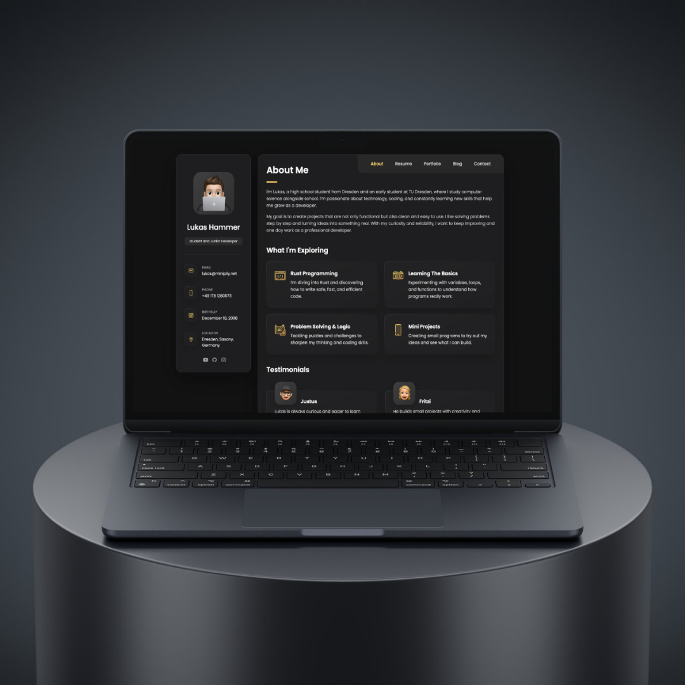
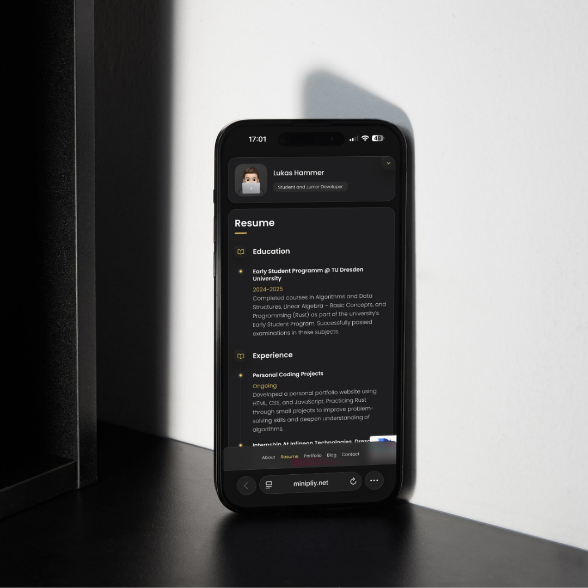

# Website template - Personal portfolio


A modern, fully responsive personal portfolio template built with HTML, CSS, and JavaScript. Optimized for all devices and easy to customize.

## Demo




## Prerequisites

Before you begin, ensure you have met the following requirements:

* [Git](https://git-scm.com/downloads "Download Git") must be installed on your operating system.

## Installing the template

To install this **website template** , follow these steps:

Linux and macOS:

```bash
sudo git clone https://github.com/Minipliy/portfolio-website.git
```

Windows:

```bash
git clone https://github.com/Minipliy/portfolio-website.git
```

## License

MIT (by [codewithadee](https://github.com/codewithsadee "codewithadee"))
